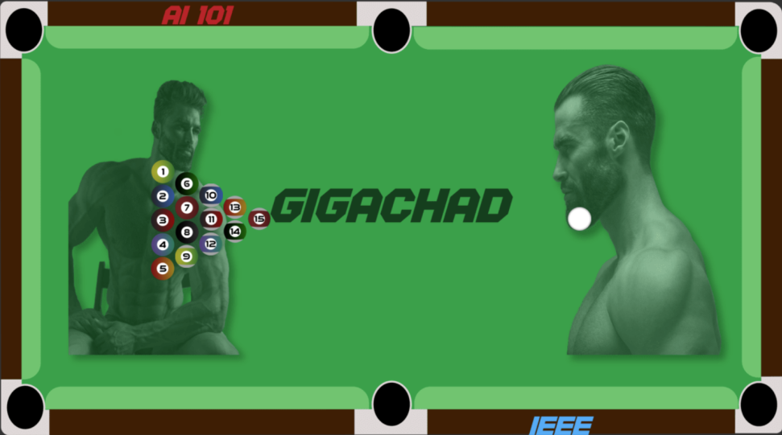

# VirtualPool

> Simple 8 ball pool game that uses hand movements as an input instead of using a mouse, keyboard, or tranditional tools.

### Table of Contents

-   [Description](#description)

    -   [Why it is built](#why-it-is-built)
    -   [Brief](#brief)
    -   [solution](#solution)

-   [Game Play Photos](#game-play-photos)
-   [Used packages/libraries](#used-packageslibraries)
-   [Setting up the environment](#setting-up-the-environment)
-   [License](#license)

---

## Description

### Why it is built

Artificial intelligence project that is built specifically to contribute to AI101 multinational event that is established by both IEEE (Institute of Electrical and Electronics Engineers) student branch AAST (Arab Academy for Science, Technology & Maritime Transport) in Egypt and INSAT (National Institute of Applied Science and Technology) in Tunisia.

### Brief

The main aim is to use body movements and hand gestures as input to this program and use this input in a creative way.

### Solution

modular python project that contains hand recognition and tracking logic and 8 ball pool to use orders that that user make using this hand.

---

## Game Play Photos

<div align="center">

</div>

---

## Used packages/libraries

-   opencv
-   mediapipe
-   numpy
-   autopy
-   pygame
-   pymunk

---

## Setting up the environment

-   install Python 3.8.10 (not all packages will work with other python versions)
-   install used packages using this command line

```properties
pip install opencv-python mediapipe numpy autopy pygame pymunk
```

[Back To The Top](#read-me-template)

---

## License

[MIT License](LICENSE)

[Back To The Top](#read-me-template)
